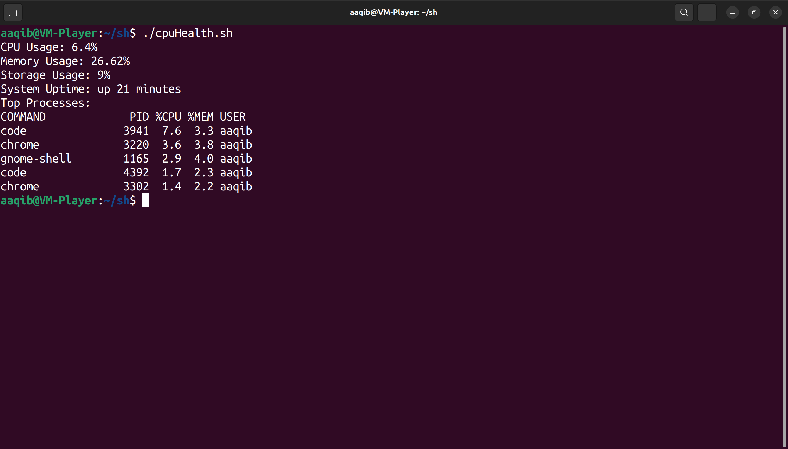
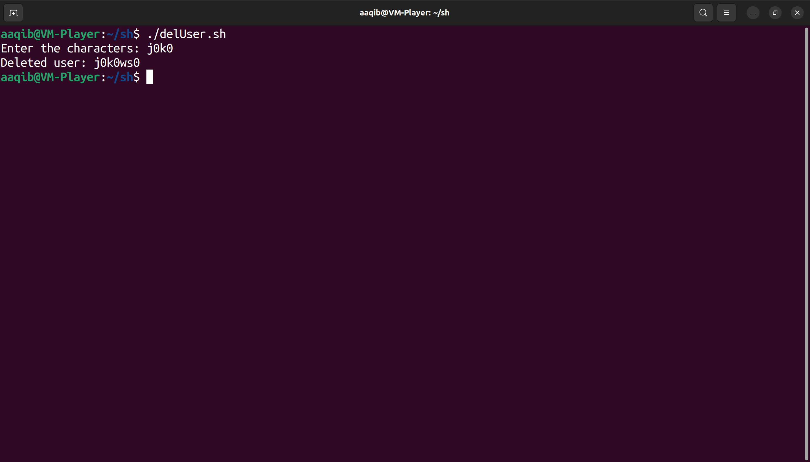

# 15 commonly used shell scripts by system admins and DevOps
In this repository I have written 15 commonly used scripts by system admins and devops engineers

1. 'cpuHealth' will show you current health of the system.

2. 'useradd.sh' will create a new using initial of the username in the format y0z0xxx if name is yhaya zia and xxx are random letters, with a random password that user will reset on first login.

3. 'delUser.sh' will delete with the initials matching the first four letters to the argument.

4. 'makearchive.sh' will create backup of directory selected in '~/backups'.

5. 'netReport.sh' will show current IP address, Default gatewaya and DNS server.
